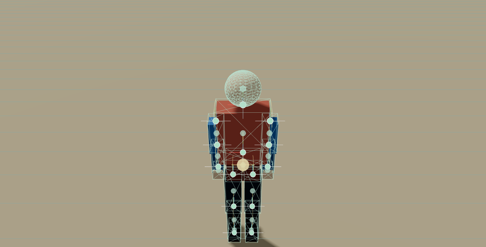
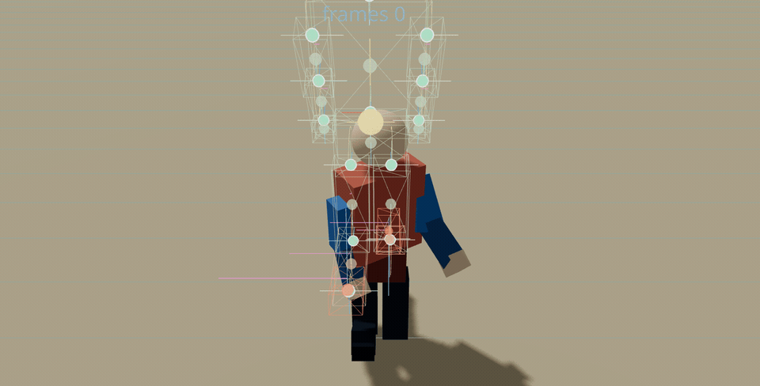

# a-character-controller

`a-character-controller` is a hybrid `library + demo` project for a React Three Fiber third-person controller stack. It ships a reusable primitive player, a follow camera with camera-occlusion handling, scoped controller state, a humanoid ragdoll dummy, and an in-world ragdoll debug lab.

## WIP

This does not work yet.

The active-ragdoll controller is still unstable and the walking controller is not solved. If you know how to make this character stand, step, and walk reliably, please help.

## Current demo capture

Active ragdoll WIP:



Current walk attempt:



Package name:

```bash
npm install a-character-controller
```

## Production active-ragdoll direction

The repo is now explicitly being pushed toward a production-capable active ragdoll for mobile and PC.

Important boundaries:

- `src/lib` is the shipping codepath
- `src/components` is demo-only support code
- the demo is used to inspect and reproduce behavior, not to host one-off controller logic
- visual debugging is treated as part of the runtime engineering surface, not as optional polish

The chosen controller family is:

- deterministic `SIMBICON`-style gait control
- `capture-point` stepping heuristics for balance recovery
- later directional locomotion expansion informed by `Generalized Biped Walking Control`

See:

- [RESEARCH.md](./RESEARCH.md)
- [ROADMAP.md](./ROADMAP.md)

## Production baseline

The library is now in a solid packageable baseline for:

- third-person movement with `idle`, `walk`, `run`, `crouch`, `jump`, and `fall`
- external or keyboard-driven input
- follow-camera control with pointer lock and scene-occlusion avoidance
- state snapshots and movement lifecycle callbacks
- a separate humanoid ragdoll test dummy with in-world debug visualization

What is not finished yet:

- step-up and slope-specialized controller handling
- tuned production active-ragdoll walking, running, and recovery behavior
- authored interaction systems for doors, vehicles, weapons, and golf
- skinned-character animation or motion-matching backends

## Current issues

The active-ragdoll controller is still experimental and currently unstable.

Known problems:

- the active ragdoll can fail to settle into a reliable neutral stand and may kneel, collapse, or oscillate after spawn
- first-step and continuous walking behavior are not yet dependable, especially when balance recovery, support switching, and leg drive interact
- turning and prolonged running can still destabilize the torso and push the controller into stumble/fall recovery
- the new scripted validation scenarios are useful for repeatability, but they are not passing yet; recent headless probes still reported the ragdoll in `fall/airborne` with lost support instead of a stable stand or walk
- ground detection has been improved with hysteresis and downward ground probes, but support/grounded transitions are still under active tuning
- the Mixamo-driven target path is useful for motion reference, but it does not yet guarantee stable physical walking
- the capsule controller remains the more reliable baseline; the active ragdoll is the current research path

Important engineering note:

- the current instability is not mainly a Rapier problem
- high COM plus small feet creates inverted-pendulum instability in any engine
- the gait FSM, balance strategy, support switching, and step-placement logic are the primary controller-side responsibilities still under active work

## Install

```bash
npm install a-character-controller react react-dom three @react-three/fiber @react-three/rapier @react-three/drei
```

## Quick start

```tsx
import { Canvas } from "@react-three/fiber";
import { Physics } from "@react-three/rapier";
import { CharacterCtrlrCameraRig, CharacterCtrlrPlayer, CharacterCtrlrProvider } from "a-character-controller";

export function Scene() {
  return (
    <CharacterCtrlrProvider initialState={{ playerPosition: [0, 2.5, 6] }}>
      <Canvas shadows camera={{ fov: 42, near: 0.1, far: 250, position: [0, 3.5, 8] }}>
        <Physics gravity={[0, -9.81, 0]}>
          <CharacterCtrlrPlayer controls="keyboard" position={[0, 2.5, 6]} />
        </Physics>
        <CharacterCtrlrCameraRig />
      </Canvas>
    </CharacterCtrlrProvider>
  );
}
```

## Controlled input example

Use `controls="none"` when you want to drive the player from your own touch, gamepad, AI, or network state.

```tsx
import { useEffect } from "react";
import { Canvas } from "@react-three/fiber";
import { Physics } from "@react-three/rapier";
import {
  CharacterCtrlrCameraRig,
  CharacterCtrlrPlayer,
  CharacterCtrlrProvider,
  useCharacterCtrlrInputController,
} from "a-character-controller";

function BotDriver() {
  const controller = useCharacterCtrlrInputController();

  useEffect(() => {
    controller.replaceInput({ forward: true, run: true });
    return () => controller.resetInput();
  }, [controller]);

  return (
    <>
      <CharacterCtrlrPlayer
        controls="none"
        inputRef={controller.inputRef}
        onGroundedChange={(grounded) => {
          if (!grounded) {
            controller.pressInput("jump", false);
          }
        }}
      />
      <CharacterCtrlrCameraRig />
    </>
  );
}

export function Scene() {
  return (
    <CharacterCtrlrProvider>
      <Canvas>
        <Physics>
          <BotDriver />
        </Physics>
      </Canvas>
    </CharacterCtrlrProvider>
  );
}
```

## Exported API

- `CharacterCtrlrProvider`
- `createCharacterCtrlrStore`
- `useCharacterCtrlrStore`
- `useCharacterCtrlrStoreApi`
- `useCharacterCtrlrKeyboardInput`
- `useCharacterCtrlrInputController`
- `CharacterCtrlrActiveRagdollPlayer` experimental
- `CharacterCtrlrPlayer`
- `CharacterCtrlrCameraRig`
- `CharacterCtrlrRagdollDummy`
- `DEFAULT_CHARACTER_CTRLR_INPUT`
- `mergeCharacterCtrlrInput`

Useful exported types:

- `CharacterCtrlrControllerState`
- `CharacterCtrlrStoreApi`
- `CharacterCtrlrStoreInit`
- `CharacterCtrlrInputState`
- `CharacterCtrlrMovementMode`
- `CharacterCtrlrPlayerSnapshot`
- `CharacterCtrlrSupportState`
- `CharacterCtrlrVec3`

## Key component props

`CharacterCtrlrPlayer` supports:

- `controls="keyboard" | "none"`
- `input` and `inputRef` for additive external input
- tunables for `walkSpeed`, `runSpeed`, `crouchSpeed`, `jumpVelocity`, `acceleration`, `deceleration`, and `airControl`
- `onSnapshotChange`, `onMovementModeChange`, `onGroundedChange`, `onJump`, and `onLand`
- `debug` for the in-world player debug overlay
- emitted snapshots currently report `supportState` as a simple `"double"` or `"none"` fallback for the capsule baseline

`CharacterCtrlrActiveRagdollPlayer` supports:

- the same input and lifecycle callback shape as `CharacterCtrlrPlayer`
- optional `mixamoSource` loading for hidden animation-target retargeting into the active ragdoll joint motors
- experimental tunables for `jumpImpulse`, `uprightTorque`, `turnTorque`, and `balanceDamping`
- experimental camera-target tuning with `cameraFocusSmoothing`, `cameraFocusHeight`, and `cameraFocusLead`
- `debug` to view the articulated rig through the ragdoll debug overlay
- emitted snapshots report articulated foot support as `"none"`, `"left"`, `"right"`, or `"double"`

Production note:

- active-ragdoll work is still marked experimental, but the implementation now has the intended long-term control architecture in place:
  - explicit gait FSM
  - phase-based pose targets
  - COM and capture-point feedback
  - step length, width, and clearance targets
  - locomotion family configs
  - recovery and deterministic gait re-entry
- grounded-state recovery now uses:
  - contact hysteresis for grounded/airborne transitions
  - delayed jump-contact clearing
  - downward Rapier ground probes under the feet as a fallback when foot contact callbacks are unreliable
- standing is now handled as a dedicated support problem rather than just an idle gait:
  - pelvis support is solved relative to the foot sole plane
  - idle and low-speed double-support use a stand-assist path
  - feet are planted and leveled while standing so the rig can hold posture before stepping
- the active-ragdoll controller internals are now split into explicit library subsystems for:
  - contact tracking and support confirmation
  - gait progression
  - standing control
  - COM / capture-point measurement
  - step planning
  - recovery classification
  - debug-state publication
- demo validation scenarios can be run with `?scenario=` query params such as:
  - `spawn_idle_stability`
  - `turn_in_place_stability`
  - `walk_start_from_rest`
  - `steady_forward_walk`
  - `walk_run_walk_transition`
  - `mild_push_recovery`
  - `no_persistent_foot_chatter`
  - `no_persistent_leg_scissoring`
- those scenarios are currently a debugging harness, not a success suite:
  - they exist to reproduce controller failures consistently
  - they should not be read as evidence that standing or walking is solved
- new locomotion, balance, and recovery work should land in the library runtime first and only then be exposed through the demo

`CharacterCtrlrCameraRig` supports:

- `followOffset`, `focusHeight`, and `smoothing`
- `pointerLock`, `yawSensitivity`, and `pitchSensitivity`
- `collisionEnabled`, `collisionPadding`, and `minCollisionDistance`

`CharacterCtrlrRagdollDummy` supports:

- `position`
- `debug`
- paused/manual-step demo debugging props for the in-repo sandbox

## Repo layout

- `src/lib`: publishable library source
- `src/components`: demo-only scene pieces
- `dist`: library build output
- `demo-dist`: demo build output
- `RESEARCH.md`: academic basis for the active-ragdoll architecture
- `ROADMAP.md`: production implementation plan and phase breakdown

## Scripts

- `npm run dev`: run the demo locally
- `npm run dev:lan`: run the demo on your LAN
- `npm run test`: run the library smoke tests
- `npm run build:lib`: build the package into `dist`
- `npm run build:demo`: build the demo into `demo-dist`
- `npm run build`: typecheck, test, and build both library and demo
- `npm run preview:lan`: preview the demo build on your LAN

Demo tip:

- the demo now defaults to the active ragdoll player
- add `?player=capsule` to the dev URL to load the capsule baseline instead
- add `?motion=mixamo` to enable the optional Mixamo target path in the ragdoll demo once the FBX files are placed in `public/mixamo`
- the current ragdoll debugging/tuning path is `http://localhost:5173/?player=ragdoll&motion=mixamo`

Mixamo tip:

- see [docs/MIXAMO.md](./docs/MIXAMO.md) for the expected FBX downloads, file layout, and `mixamoSource` usage

## Design direction

The current shipping strategy is deliberate: keep control, camera, state, and interaction logic deterministic first, then add more sophisticated animation systems later. For the active ragdoll specifically, that now means a production-focused finite-state controller with explicit support, foot planting, COM, capture-point, and balance diagnostics before any learned or mocap-heavy runtime is considered.

See also:

- [ROADMAP.md](./ROADMAP.md)
- [RESEARCH.md](./RESEARCH.md)
